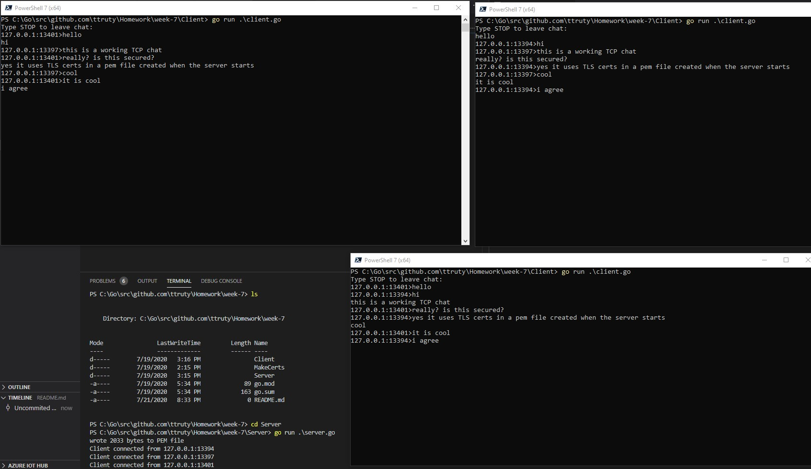

# Go Lang Final Project
## TCP Server and client for chat

This project is a TCP messaging server.
Each connected clients is able to send a message. That message in turn is forwarded to all connected clients. The messages are secured using TLS.

The creation of the server creates the TLS certifications.

